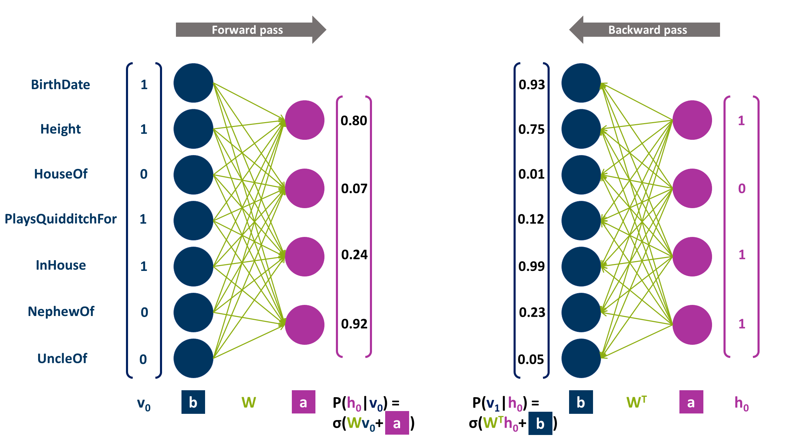

# Entity Similarity-Based Negative Sampling With Stochastic Neural Networks in Knowledge Graph Embeddings

This repository contains the code base of Jannis Guski's Master's thesis at Ruhr University Bochum, submitted January 19, 2023. 

## Thesis Abstract

Knowledge Graph Embedding (KGE) aims at mapping the elements of Knowledge Graphs (KGs) (knowledge bases representing statements in the form of subject entity - relation - object entity triples) into a low-dimensional vector space, thereby enabling the prediction of triples missing in the original KG. KGE is a machine learning process that relies on contrasting positive observed triples from the KG with negatives ones, which are created by replacing either subject or object entity of the positive triple. It has been found that sampling negatives at random will often produce statements that are too easy to discriminate from positive statements, causing KGE convergence to slow down. Therefore, building negatives around entities sharing a similar semantic context within the KG has been proposed. In this work, we demonstrate that basing similarity not on the observed context, but the underlying distribution of this context as approximated by a stochastic neural network - namely a Restricted Boltzmann Machine (RBM) - can help to improve the final KGE model, potentially by compensating for missing context information for individual entities. This effect was more pronounced in more complex KGE approaches like RotatE than in simpler ones like TransE. Additionally, we provide extensive benchmarking of different variants of our sampler, which especially stresses the high importance of a thorough exploration-exploitation calibration depending on chosen dataset and KGE approach.

## Getting Started

Simply install `PyKEEN` via `pip install pykeen` and get going! Version `1.9.0` was used for the experiments reported in the thesis.

## Scripts and Notebooks

On the highest level of this repository, you can find some Python scripts and Jupyter Notebooks. 

1. `hyperparameter_tuning.py`: A python script to perform `PyKEEN`'s `hpo` on defined setups of dataset, KGE model and negative sampler. Remember to comment out / in ranges or fixed values of parameters that you want to optimise or not optimise. 

2. `neg_samplers_experiments.py`: Runs `PyKEEN` pipeline for a number of defined experiments. Will load hyperparameters from `Output/hpo` directory if possible or use default parameters otherwise. The standard are three trials per experiment. 

3. `kg_statistics.ipynb`: A Jupyter notebook to compute a number of descriptive metrics and create plots on the used KGs and similarity indices that were also included in the thesis.

4. `neg_triples_quality_analysis.ipynb`: A Jupyter notebook to create Complementary Cumulative Distribution Function (CCDF) plots to estimate the distribution of similarity-based and non-similar negative samples (and thus their quality) as included in the thesis. Requires the trained KGE models in a folder structured as provided by `neg_sampler_experiments.py`.

## Negative Samplers

Entity Similarity-Based Negative Samplers (ESNS) come in two groups: With exploration mechanism (Yao et al., 2022; `negative_samplers/esns_with_exploration_mechanism`) and without exploration mechanism (`negative_samplers/esns_without_exploration_mechanism`).

Depending on how their similarity index has been computed, four different ESNS techniques are available:

1. `ESNSStandard`: Original ESNS implementation as suggested by Yao et al. (2022) ("ESNS Original" in the thesis; only with exploration mechanism)

2. `ESNSRelaxed` and `ESNSRelaxedNoExploration`: ESNS with context similarity concept based on absolute distances between relation signatures ("ESNS Relation Signature" in the thesis)

> Example of a relation signature in the left column vector (blue) of the forward pass figure.

3. `ESNSRidle` and `ESNSRidleNoExploration`: ESNS with context similarity concept based on cosine distances between latent RBM encodings ("ESNS RIDLE" in the thesis; `rbm_layer` argument determines if compressed (hidden) or reconstructed (visible) layer encoding is used). RBM-related code was adopted from Weller & Acosta (2021) (https://github.com/TobiWeller/Ridle).

> Example of a hidden layer encoding in the right column vector (purple) of the forward pass figure, example of a visible layer encoding in the left column vector (blue) of the backward pass figure. 

4. `ESNSBaselineNoExploration`: Constrained random baseline (only without exploration mechanism)

## Shift-based loss and `PyKEEN` modifications

The shift-based loss from Yao et al. (2022) has been implemented for `PyKEEN` (`losses/custom_losses.py`). Furthermore, some modifications had to be made in `PyKEEN` scripts to make the KGE model available within the negative sampler classes (needed for the variants with exploration mechanism, but is also still coded in the variants without exploration mechanism to adopt the device (CPU or GPU) of the KGE model) and to add a callback for negative sample quality analysis during fitting. The modified scripts can be found in `modified_pykeen` and need to be used in experiments with the custom samplers (cf. `neg_samplers_experiments.py` and `hyperparameter_tuning.py`)

## References
*Weller, T. and M. Acosta (2021). “Predicting Instance Type Assertions in Knowledge Graphs Using Stochastic Neural Networks”. In: Proceedings of the 30th ACM International Conference on Information & Knowledge Management. Ed. by G. Demartini, G. Zuccon, J. S. Culpepper, Z. Huang, and H. Tong. New York, NY, USA: ACM, pp. 2111–2118.*

*Yao, N., Q. Liu, X. Li, Y. Yang, and Q. Bai (2022). “Entity Similarity-Based Negative Sampling for Knowledge Graph Embedding”. In: PRICAI 2022: Trends
in Artificial Intelligence, pp. 73–87.*

*(This work will be subject of a conference paper in the future.)*